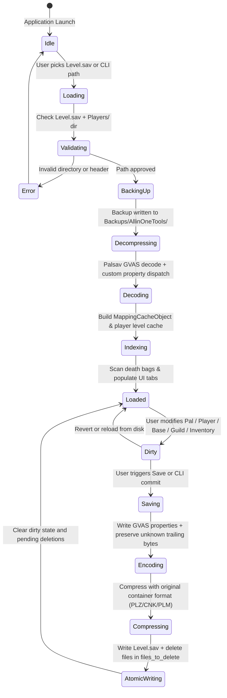

# 001 — Migration Baseline Behavior Matrix and Refactor Contracts

## 1. Baseline Confirmation

- **Runtime Target**: Python 3.11+ using PyQt6 (`PyQt6>=6.8`) as the sole GUI framework.
- **Save Engine**: `palsav` package (`src/palsav/`) with native C++ acceleration via `palooz` for Oodle/Kraken decompression.
- **Dependency & Build Management**: `pyproject.toml` with `uv` as the authoritative package manager.
- **Platform Scope**: Windows (primary target with shell launchers `start.cmd`, `test.cmd`), Linux, and macOS.

---

## 2. Inventory of Actions and Workflows

### 2.1 GUI Presentation and Navigation
- **Window Frame & Shell**:
  - `MainWindow` (`src/palworld_aio/ui/main_window.py`): central orchestrator managing menus, navigation, toolbar, status bar, and tab stacked layout.
  - Collapsible Sidebar with 12 view entries (Save/Session, Players, Guilds, Bases, Pal Editor, Inventory, Base Inventory, Map, Breeding, Diagnostics, Tools, JSON Editor, Wiki).
  - Header with branding badges, current save indicator, and status badge.
  - Detached Status Console (`DetachedStatusWindow`) for real-time progress logging and diagnostics.

- **Primary Tabs & Workbenches**:
  1. **Save/Session View**: Directory selection, recent save prefill, drag-and-drop overlay for `Level.sav`, isolated GlobalPalStorage (GPS) session mode.
  2. **Player Management**: List players with levels, pal counts, last online timestamps; rename player, delete player, edit player items, edit player pals, edit player technology points/unlocks, fix negative timestamps.
  3. **Guild Management**: List guilds, member rosters, base assignments; rename guild, change guild level, promote leader, move player between guilds, delete empty guilds, rebuild guild structures.
  4. **Base Management**: List base camps, coordinate locations, worker capacity; change base radius/area range, clone base, export base to JSON, import base from JSON, delete base camp.
  5. **Pal Editor** (`src/palworld_aio/editor/pal_editor/`):
     - Visual Palbox grid (64 boxes × 30 slots = 1,920 slots) and Party grid (5 slots).
     - Pal inspector: Nickname, Level, Exp, Gender, Pal Type/Element, IVs (HP, Attack, Defense), Souls (Health, Attack, Defense, CraftSpeed), Passive Skills (up to 4), Active Skills (up to 3 equipped + pool), Condenser Rank, Rank points.
     - Bulk operations: Level all pals, max IVs, heal all pals, unlock skills, remove illegal skills.
     - Global operations: Export/import pal `.pstpal` payloads.
  6. **Inventory Tab**: Player inventory lanes (Common, Essential/Key, Weapon, Armor, Food); search items across all players and guilds; add/edit/remove item stacks; loadout presets.
  7. **Base Inventory Tab**: Base container picker, chest slot injector, chest expansion, loadout presets.
  8. **Map Tab** (`src/palworld_aio/ui/tabs/map_tab.py`):
     - Interactive Leaflet/Canvas rendering with fit-to-view zoom and pan.
     - Dual map calibration: Pre-Sakurajima and Post-Sakurajima world coordinate systems.
     - Draggable markers for players, bases, fast travel points, bosses, and death bags.
     - Fog restoration tool and zone exclusion drawing (rect/polygon).
  9. **Breeding Tab**: Deterministic parent-combination calculator, child target solver, unique breeding pair exclusions.
  10. **Diagnostics & Maintenance**:
      - Harvest world index and sweep orphan objects.
      - Scan and repair illegal pals, illegal player stats, illegal passive skills, and illegal active skills.
      - Detect and trim overfilled inventories with safety buffer (+50 slots).
      - Death bag protection guard (`scan_and_protect_death_bags`).
      - Anti-air turret reset, dungeon reset, oil rig reset, supply drop reset.
  11. **Tools Tab**:
      - SAV <-> JSON converter (minified and formatted).
      - Character transfer and host swap (GUID remap).
      - Xbox Game Pass (XGP) save discovery, extraction, and container repackaging.
      - Palbox slot injector and map fog clearer.
  12. **JSON Editor Tab**: Read-only JSON tree inspection with search, schema diff, and safety-gated write confirmation.
  13. **Wiki / Docs Tab**: Integrated multi-language guides (EN, ZH, DE, ES, FR, JA, KO, RU).

### 2.2 CLI Entry Points and Scripts
- `start.py` / `start.cmd`: Virtual environment verification, dependency sync via `uv sync`, logo banner display, and handoff to `src/bootup.py`.
- `src/bootup.py`: Pre-flight environment validation, GUI splash screen with animated progress bar and status messages, background requirement check, configuration migration (`_migrate_configs`), and execution of `src/palworld_aio/main.py`.
- `src/palworld_aio/main.py`:
  - Headless CLI mode: `python src/palworld_aio/main.py <path_to_Level.sav> [-logs] [-fix]`.
    - `-logs`: Generates diagnostic scan logs in `Logs/Scan Save Logger/`.
    - `-fix`: Executes automated cleanup operations (invalid items, pals, passives, structures, unreferenced data, non-base map objects) and commits changes atomically to `Level.sav` and `Players/`.
  - UI mode: Fusion theme setup, icon loading, `MainWindow` instantiation.
- `scripts/scrs/`:
  - `generate_test_fixtures.py`: Deterministically builds minimal sanitized test save fixtures.
  - `validate_imports.py`: Verifies importability and attribute presence across all internal modules.
  - `check_theme_violations.py`: AST scanner checking Qt widgets for hardcoded colors violating theme tokens.
  - `auto_update.py`: Release checker and self-updater.
  - `build_cx.py`: cx_Freeze standalone distribution packager.
  - `clear_fog.py`: CLI map fog restoration tool.
  - Translation tools: `add_translation_keys.py`, `update_translation_keys.py`, `translate_changelog.py`, `translate_readme.py`, `translate_tab_guide.py`.

---

## 3. Save File Formats and Container Hierarchy

| File / Format | Container / Compression | Header / Class Name | Primary Contents |
|---|---|---|---|
| `Level.sav` | GVAS inside Double-Zlib (PLZ 0x32), Chunked (CNK 0x30), or Oodle (PLM 0x31) | `/Script/Pal.PalWorldSaveGame` | `worldSaveData` (`CharacterSaveParameterMap`, `GroupSaveDataMap`, `ItemContainerSaveData`, `CharacterContainerSaveData`, `BaseCampSaveData`, `MapObjectSaveData`, `WorkSaveData`, `FoliageGridSaveDataMap`, etc.) |
| `LocalData.sav` | GVAS inside PLZ/CNK/PLM | `/Script/Pal.PalLocalWorldSaveGame` | `SaveData` (local world settings, player local data, fog texture masks) |
| `<PlayerUId>.sav` | GVAS inside PLZ/CNK/PLM | `/Script/Pal.PalWorldPlayerSaveGame` | `SaveData` (player record, unlocked fast travel, tech tree, inventory references) |
| `<PlayerUId>_dps.sav` | GVAS inside PLZ/CNK/PLM | `/Script/Pal.PalWorldPlayerDynamicSaveGame` | Dynamic character properties, custom loadouts |
| `GlobalPalStorage.sav` | GVAS inside PLZ/CNK/PLM | `/Script/Pal.PalGlobalPalStorageSaveGame` | Global cross-world pal storage container |
| Xbox Game Pass Package | UWP directory structure (`wgs/<User_Title>/`) | `containers.index` (v14) + `container.<N>` manifests | Raw `.sav` payloads mapped to GUID container filenames |
| JSON Save Export | UTF-8 JSON | Structural dict (`header`, `properties`, `trailer`) | Decoded property hierarchy with base64/nested custom types |
| Backup Archive (`.pst3` / `.7z`) | Compressed archive | PST3 / Zip / 7z | Complete directory snapshot of `Level.sav` + `Players/` |

---

## 4. Lifecycle and State Invariants

### 4.1 Load Lifecycle
1. **Path Validation**: Must point to a valid `Level.sav` accompanied by a sibling `Players/` directory.
2. **Pre-mutation Backup**: Before any parse or modification, `backup_whole_directory` creates a full timestamped snapshot under `Backups/AllinOneTools/`.
3. **Decompression & Codec Dispatch**: Decompresses container bytes via `decompress_sav_to_gvas`, extracts GVAS header, and decodes properties using `PALWORLD_CUSTOM_PROPERTIES` and `PALWORLD_TYPE_HINTS`.
4. **Cache & Index Construction**: `MappingCacheObject` indexes character and guild mappings; player levels are harvested; death bags are identified and flagged for protection.

### 4.2 Mutation & Dirty State
- Modifications are made to loaded in-memory representations (`constants.loaded_level_json` or domain managers).
- Player deletions stage the target GUID in `constants.files_to_delete` rather than deleting immediately.
- Destructive operations (sweeps, resets, trims) require preview inspection and explicit confirmation.

### 4.3 Save & Commit Lifecycle
1. **Trailing Byte Preservation**: All custom property encoders (character, base camp, group, work, map objects) MUST preserve unparsed trailing bytes byte-for-byte to maintain forward compatibility with game updates.
2. **GVAS Serialization**: Encodes modified structures back into GVAS binary representation.
3. **Compression & Atomic Replacement**: Recompresses with the appropriate container format (PLZ/CNK/PLM) and replaces destination files atomically.
4. **Pending Deletion Execution**: Files registered in `constants.files_to_delete` (both `<uid>.sav` and `<uid>_dps.sav`) are removed from `Players/`, and the set is cleared.

---

## 5. Fallback and Error Behavior

- **Unknown Properties**: Properties not in `PALWORLD_TYPE_HINTS` or `PALWORLD_CUSTOM_PROPERTIES` are preserved as generic Unreal Engine property structures without mutation.
- **Corrupted Blobs**: If a single player save or custom property chunk fails to decode, diagnostics log the failure without discarding unaffected save sections.
- **Unreferenced Entities**: Orphan sweeps and cleanup functions operate only upon user invocation and maintain confirmation barriers before pruning unreferenced instances.
- **Death Bag Protection**: Death bags identified in `scan_and_protect_death_bags` are strictly protected from accidental deletion during orphan sweeps.

---

## 6. Frozen Builds and Resource Resolution

- **Standalone Detection**: `getattr(sys, 'frozen', False)` determines whether execution is running from source or from a cx_Freeze / Nuitka standalone bundle.
- **Binary Root Resolution**: `sys._PALTRAINER_BINARY_ROOT` resolves the root folder containing `resources/`.
- **Config Directory Separation**:
  - Development / source: Uses `src/data/configs/` or project config directory.
  - Frozen standalone: Automatically migrates bundled default configs to writable user config directory (`USER_CONFIG_DIR`) via `_migrate_configs()`.
- **Resource Lookups**: All fonts, icons, maps, translations, and game data catalogs are resolved through `resource_resolver.resource_path()` and validated against `RESOURCE_MAP`.

---

## 7. Fixture Policy and Testing Baseline

- **Zero-Real-Save Security Rule**: Real player saves, confidential exports, and machine-specific save folders must never be committed to source control (`.gitignore` enforces `*.sav`, `*.savc`, `pal-save/`).
- **Sanitized Synthetic Fixtures**: `scripts/scrs/generate_test_fixtures.py` creates minimal valid `Level.sav`, `LocalData.sav`, `00000000000000000000000000000001.sav`, and `00000000000000000000000000000001_dps.sav` under `tests/save_test/`.
- **Automated Test Bootstrap**: `tests/conftest.py` automatically checks and provisions synthetic fixtures if absent during session start.
- **Test Suite Gates**:
  - Fast suite: 312 unit and integration tests (structural audit, file pairing, AST theme violation check, game data JSON validation, module imports, core logic).
  - Slow suite: 20 integration tests verifying decompression, GVAS parsing, property integrity, dump roundtrip, and byte-for-byte serialization roundtrip.
  - Full suite: 332 tests passing with 0 failures.
  - Compilation: `python -m compileall -q src tests` passes with 0 syntax errors.
